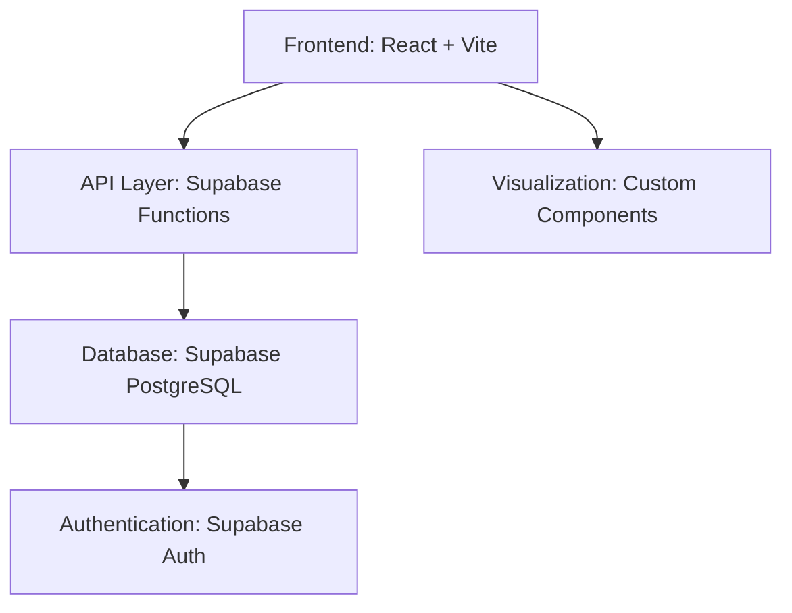

# Student Analysis Platform

A robust, scalable, and secure web application for student data analysis, built with React, TypeScript, Vite, Tailwind CSS, and Supabase. Designed for educational institutions and analytics professionals, this platform enables seamless data upload, visualization, and actionable insights.

---

## Table of Contents
- [Features](#features)
- [Architecture](#architecture)
- [Tech Stack](#tech-stack)
- [Installation](#installation)
- [Usage](#usage)
- [Project Structure](#project-structure)
- [API & Database](#api--database)
- [Testing](#testing)
- [Contributing](#contributing)
- [License](#license)

---

## Features

---

## Course Outcomes (COs) & Program Outcomes (POs)

### What are COs and POs?
**Course Outcomes (COs)** are specific, measurable statements describing what students should know, be able to do, or demonstrate at the end of a course. **Program Outcomes (POs)** are broader objectives that reflect the skills, knowledge, and attitudes students should acquire by completing an academic program.

### Why are COs and POs Important?
COs and POs are essential for curriculum design, accreditation, and continuous improvement. They help:
- Align teaching and assessment with institutional goals
- Track student achievement and identify learning gaps
- Meet accreditation requirements (NBA, ABET, etc.)
- Provide actionable insights for faculty and administrators

### How This Platform Supports CO/PO Analysis
- **CO/PO Mapping**: Upload and define mappings between assessments, COs, and POs. Link each question or activity to relevant outcomes.
- **Attainment Calculation**: Automatically calculate attainment levels for each CO and PO based on student performance and predefined thresholds.
- **Visualization**: Interactive dashboards display CO/PO attainment, achievement gaps, and trends across courses, batches, and programs.
- **Gap Analysis**: Identify which outcomes are not being achieved and recommend targeted interventions.
- **Reporting**: Export detailed CO/PO attainment reports for accreditation and internal review.

### Example Workflow
1. Upload student marks and assessment data.
2. Define COs for each course and POs for the program.
3. Map each assessment item to COs and link COs to POs.
4. Analyze attainment and achievement using the dashboard.
5. Export reports for faculty, management, and accreditation bodies.

### Supported Accreditation Standards
This platform is designed to support outcome-based education and accreditation standards such as NBA (India), ABET (USA), and others.

---

---

## Architecture


---

## Tech Stack
- **Frontend**: React, TypeScript, Vite
- **Styling**: Tailwind CSS, PostCSS
- **Backend/API**: Supabase
- **Database**: PostgreSQL (via Supabase)
- **Testing**: (Add preferred testing framework, e.g., Jest, React Testing Library)
- **CI/CD**: (Add preferred CI/CD tools, e.g., GitHub Actions)

---

## Installation

### Prerequisites
- Node.js (>= 16.x)
- npm or yarn
- Supabase account & project

### Steps
1. **Clone the repository:**
   git clone https://github.com/your-org/student-analysis.git
   cd student-analysis
   ```
2. **Install dependencies:**
   ```bash
**Professional Note:**
This project follows industry best practices for code quality, security, and scalability. It is designed to support accreditation requirements by providing robust CO/PO mapping and attainment analysis. Please review the documentation and code comments for further guidance.
   npm install
   # or
   yarn install
   ```
3. **Configure environment:**
   - Create a `.env` file based on `.env.example`.
   - Add your Supabase credentials.
4. **Run the development server:**
   ```bash
   npm run dev
   ```
5. **Build for production:**
   ```bash
   npm run build
   ```

---

## Usage
- **Login**: Authenticate using Supabase Auth.
- **Upload Data**: Use the FileUpload component to upload student datasets.
- **View Dashboard**: Access analytics and visualizations in the Dashboard.
- **Export Results**: Download processed analysis as CSV/Excel.

---

## Project Structure

```
student-analysis/
├── public/                # Static assets
├── src/
│   ├── components/        # React components
│   ├── lib/               # Utility libraries (analysis, API, auth)
│   ├── types/             # TypeScript types
│   ├── App.tsx            # Main app entry
│   ├── main.tsx           # Vite entry point
│   └── index.css          # Tailwind CSS
├── supabase/              # Database migrations
├── package.json           # Project metadata
├── vite.config.ts         # Vite configuration
├── tailwind.config.js     # Tailwind configuration
└── ...
```

---

## API & Database
- **Supabase**: Used for authentication, database, and API functions.
- **Migrations**: SQL files in `supabase/migrations/` for schema management.
- **Endpoints**: Custom API logic in `src/lib/api.ts`.

---

## Testing
- Add tests in `src/__tests__/` or alongside components.
- Use Jest/React Testing Library for unit and integration tests.
- Run tests:
  ```bash
  npm test
  ```

---

## Contributing

We welcome contributions from the community and industry professionals.

1. Fork the repository.
2. Create a feature branch (`git checkout -b feature/your-feature`).
3. Commit your changes.
4. Push to your branch and open a Pull Request.
5. Ensure your code follows our style guide and passes all tests.

---

## License

This project is licensed under the MIT License.

```
MIT License

Copyright (c) 2026 Krishna

Permission is hereby granted, free of charge, to any person obtaining a copy
of this software and associated documentation files (the "Software"), to deal
in the Software without restriction, including without limitation the rights
to use, copy, modify, merge, publish, distribute, sublicense, and/or sell
copies of the Software, and to permit persons to whom the Software is
furnished to do so, subject to the following conditions:

The above copyright notice and this permission notice shall be included in all
copies or substantial portions of the Software.

THE SOFTWARE IS PROVIDED "AS IS", WITHOUT WARRANTY OF ANY KIND, EXPRESS OR
IMPLIED, INCLUDING BUT NOT LIMITED TO THE WARRANTIES OF MERCHANTABILITY,
FITNESS FOR A PARTICULAR PURPOSE AND NONINFRINGEMENT. IN NO EVENT SHALL THE
AUTHORS OR COPYRIGHT HOLDERS BE LIABLE FOR ANY CLAIM, DAMAGES OR OTHER
LIABILITY, WHETHER IN AN ACTION OF CONTRACT, TORT OR OTHERWISE, ARISING FROM,
OUT OF OR IN CONNECTION WITH THE SOFTWARE OR THE USE OR OTHER DEALINGS IN THE
SOFTWARE.
```

---

## Contact & Support

For support, feature requests, or business inquiries, please contact Krishna at [krishnarane2005@example.com].

---

## Course Outcomes (COs) & Program Outcomes (POs)

### What are COs and POs?
**Course Outcomes (COs)** are specific, measurable statements describing what students should know, be able to do, or demonstrate at the end of a course. **Program Outcomes (POs)** are broader objectives that reflect the skills, knowledge, and attitudes students should acquire by completing an academic program.

### Why are COs and POs Important?
COs and POs are essential for curriculum design, accreditation, and continuous improvement. They help:
- Align teaching and assessment with institutional goals
- Track student achievement and identify learning gaps
- Meet accreditation requirements (NBA, ABET, etc.)
- Provide actionable insights for faculty and administrators

### How This Platform Supports CO/PO Analysis
- **CO/PO Mapping**: Upload and define mappings between assessments, COs, and POs. Link each question or activity to relevant outcomes.
- **Attainment Calculation**: Automatically calculate attainment levels for each CO and PO based on student performance and predefined thresholds.
- **Visualization**: Interactive dashboards display CO/PO attainment, achievement gaps, and trends across courses, batches, and programs.
- **Gap Analysis**: Identify which outcomes are not being achieved and recommend targeted interventions.
- **Reporting**: Export detailed CO/PO attainment reports for accreditation and internal review.

### Example Workflow
1. Upload student marks and assessment data.
2. Define COs for each course and POs for the program.
3. Map each assessment item to COs and link COs to POs.
4. Analyze attainment and achievement using the dashboard.
5. Export reports for faculty, management, and accreditation bodies.

### Supported Accreditation Standards
This platform is designed to support outcome-based education and accreditation standards such as NBA (India), ABET (USA), and others.

---